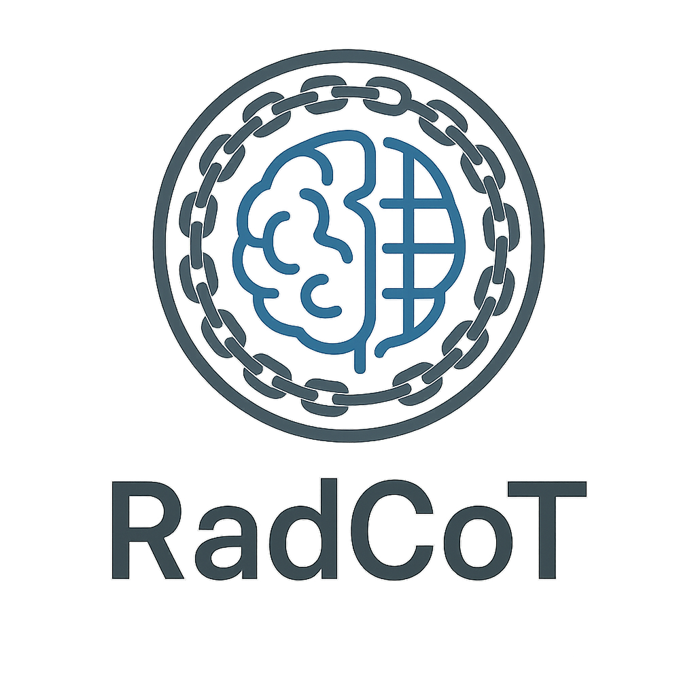

<p align="center">
  
</p>

# RadCoT: Radiological Chain-of-Thought Framework

A specialized reasoning framework for enhanced error detection in radiology reports.
# RadCoT: Radiological Chain-of-Thought Framework

## Overview

RadCoT (Radiological Chain-of-Thought) is a specialized reasoning framework that adapts chain-of-thought prompting to the unique structure and requirements of radiology report error detection. This repository provides a complete implementation of the RadCoT framework as described in our research.

The framework enables large language models (LLMs) to perform structured, domain-specific reasoning when analyzing radiology reports, significantly improving error detection performance. RadCoT is designed to work with both commercial (e.g., GPT-4o) and open-source (e.g., Llama 3, Mixtral) language models.

## Features

- **Six-Step Radiological Reasoning**: Implementation of the complete RadCoT framework with anatomical validation, measurement checking, cross-sectional correlation, findings-impression alignment, clinical completeness assessment, and terminology verification
- **Multiple Model Support**: Compatible with GPT-4o, Llama 3-70b, and Mixtral 8x22b
- **Comprehensive Evaluation**: Tools for assessing performance across different error types and imaging modalities
- **Sample Reports**: Example radiology reports with various types of errors for testing
- **Visualization Tools**: Utilities for visualizing reasoning patterns and error distributions

## Installation

```bash
# Clone the repository
git clone https://github.com/username/radcot.git
cd radcot

# Install dependencies
pip install -r requirements.txt

# Install the package
python setup.py install